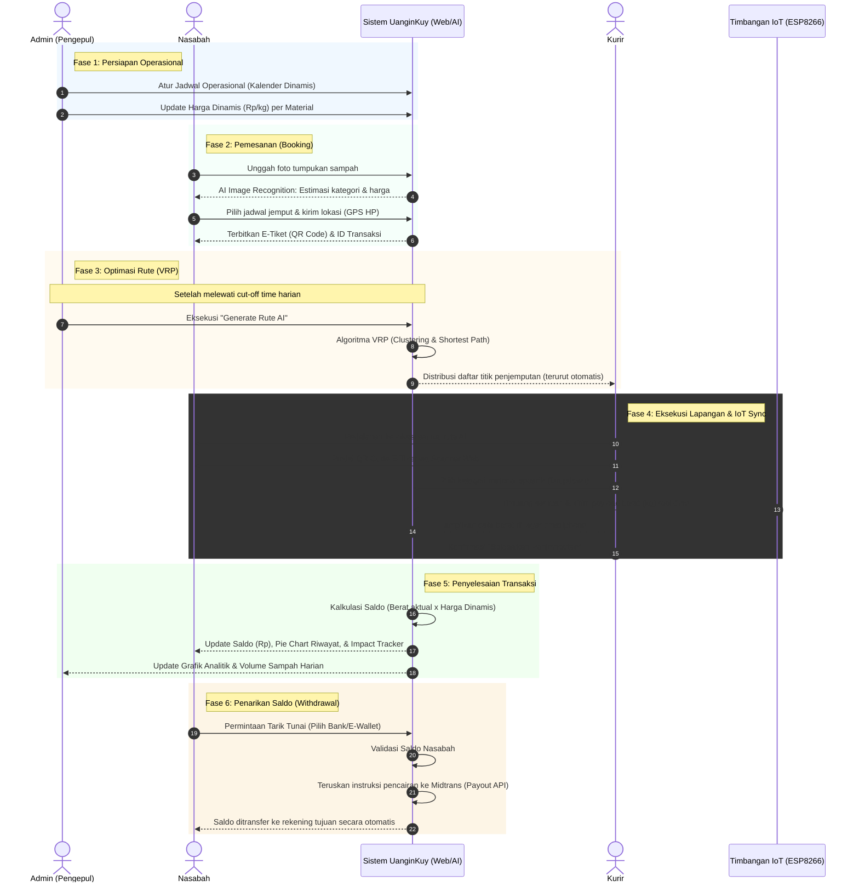

# System Flow UanginKuy

Dokumen ini menjelaskan alur kerja (system flow) dari platform **UanginKuy**, berdasarkan *Product Requirements Document* (PRD). Alur ini melibatkan Admin, Nasabah, Sistem AI, Kurir, dan perangkat keras Timbangan IoT (ESP8266).

## Diagram Alur (Sequence Diagram)

Berikut adalah visualisasi interaksi antar entitas dalam sistem:

## Penjelasan Fase Alur Sistem

### 1. Fase Persiapan Operasional (Admin)
Pada tahap ini, Admin bertanggung jawab untuk menginisiasi operasi sistem. Admin masuk ke panel **SaaS Approach** untuk menentukan hari apa saja pengepul menerima setoran (*Kalender Dinamis*) dan memperbarui harga beli per kilogram sampah sesuai dengan kondisi pasar (*Harga Dinamis*).

### 2. Fase Pemesanan / Booking (Nasabah)
Nasabah menggunakan **Client Web** untuk merencanakan setoran sampah:
- Nasabah dapat menggunakan fitur **Estimasi Harga** dengan mengunggah foto barang bekas untuk mendapatkan prediksi jenis material dan kisaran harganya.
- Nasabah memilih hari penjemputan (hanya bisa memilih tanggal yang telah dibuka oleh Admin di langkah 1).
- Sistem akan meminta akses lokasi (GPS) dari *smartphone* nasabah untuk menentukan titik koordinat penjemputan secara otomatis.
- Setelah selesai, sistem menerbitkan **E-Tiket berupa QR Code** berisi ID Transaksi unik sebagai bukti booking.

### 3. Fase Optimasi Rute / VRP (Admin & Sistem)
Setelah batas waktu pemesanan (*cut-off time*) untuk hari operasional terlampaui:
- Admin menekan tombol **Generate Rute Penjemputan** di dashboard.
- Sistem menggunakan algoritma spasial **Vehicle Routing Problem (VRP)** untuk membagi tugas kepada kurir (clustering) dan mengurutkan titik jemput (*waypoints*) menjadi rute paling optimal/terpendek.
- Rute harian yang sudah dioptimasi ini kemudian didistribusikan ke perangkat masing-masing kurir.

### 4. Fase Eksekusi Lapangan (Kurir & Timbangan IoT)
Kurir beroperasi menggunakan **Courier Web App** (melalui smartphone):
- Kurir membuka daftar *waypoints* harian dan menuju lokasi nasabah berdasarkan urutan yang diberikan sistem AI.
- Tiba di lokasi, kurir menggunakan kamera HP untuk memindai QR Code dari E-Tiket nasabah.
- Kurir memilih kategori barang secara lebih spesifik melalui *dropdown*.
- Proses penimbangan dilakukan secara otomatis menggunakan perangkat **Timbangan IoT (ESP8266 + Load Cell)**. Alat ini mengirimkan data berat (dalam kg) secara sinkron (real-time) melalui Wi-Fi/Tethering ke sistem, yang langsung tampil di layar HP kurir, tanpa input manual.
- Kurir menekan tombol "Selesaikan Penjemputan" setelah semua sesuai.

### 5. Fase Penyelesaian (Sistem)
- Sistem menghitung total uang yang didapat nasabah (berdasarkan berat timbangan IoT dikalikan harga material dari sistem).
- **Dashboard Nasabah** diperbarui secara instan: Saldo rupiah bertambah, persentase jenis sampah (*Pie Chart*) diperbarui, dan *Environmental Impact Tracker* (seperti pengurangan emisi karbon) dikalkulasi.
- **Dashboard Admin** juga diperbarui dengan data analitik terbaru seperti tren volume sampah.

### 6. Fase Tarik Tunai / Pencairan Saldo (Opsional)
- Nasabah memilih opsi "Tarik Tunai" dari *Dashboard Client*.
- Nasabah memasukkan nominal penarikan dan memilih metode pencairan (Bank atau E-Wallet).
- Sistem memvalidasi ketersediaan saldo dan mengirimkan permintaan *payout* melalui **Payment Gateway Midtrans**.
- Midtrans akan mendistribusikan dana secara otomatis dan instan ke rekening nasabah tanpa proses transfer manual oleh Admin.

## Tampilan Antarmuka

### 1. Modul Nasabah (Client Web)
Antarmuka yang digunakan oleh pengguna/nasabah untuk melakukan pemesanan dan melihat riwayat:
- **Halaman Dashboard**:
  - **Bagian Atas**: Menampilkan total saldo berjalan (Rp), tombol tarik tunai
  - **Bagian Tengah**: Visualisasi *Pie Chart* proporsi jenis sampah yang pernah disetor, serta *Environmental Impact Tracker* (kalkulasi penghematan emisi karbon).
  - **Tombol Aksi**: Tombol cepat untuk membuat jadwal setoran baru.
- **Halaman Pemesanan & Estimasi Harga**:
  - Area unggah foto barang bekas.
  - Panel hasil estimasi AI (kategori dan perkiraan harga).
  - Kalender dinamis untuk memilih tanggal penjemputan sesuai ketersediaan.
  - Peta miniatur atau konfirmasi titik penjemputan berdasarkan lokasi GPS otomatis dari perangkat.
- **Halaman E-Tiket**: Menampilkan *Barcode/QR Code* beserta ID Transaksi untuk dipindai oleh kurir.
- **Halaman Tarik Tunai (Withdrawal)**:
  - Form input nominal penarikan saldo.
  - Opsi pemilihan saluran pencairan dana (Rekening Bank atau E-Wallet/Gopay/OVO via Midtrans).
  - Tabel riwayat status penarikan dana.
- **Widget Chatbot**: Tombol *floating* di pojok layar untuk mengakses Asisten AI (tanya-jawab otomatis).

### 2. Modul Kurir (Courier Web App)
Antarmuka *mobile-first* yang dirancang khusus untuk petugas penjemput di lapangan:
- **Halaman Rute Harian**:
  - **Peta Interaktif**: Peta *responsive* (MapLibre GL & OpenFreeMap) yang memvisualisasikan garis rute penghubung antar titik jemput nasabah secara berurutan.
  - **Daftar Tugas & Navigasi**: Daftar nasabah yang harus dikunjungi, dilengkapi tombol khusus **"Navigasi"** (menggunakan metode *Deep Link* untuk membuka aplikasi Google Maps secara native di HP kurir).
  - Indikator status tiap tugas (Menunggu, Sedang Dijemput, Selesai).
- **Halaman Eksekusi Penjemputan**:
  - **Scanner Terintegrasi**: Menggunakan kamera *smartphone* untuk memindai QR Code nasabah.
  - **Form Input**: *Dropdown* untuk memilih kategori material secara spesifik (Plastik PET, Besi, Kardus, dll).
  - **Panel IoT Sync**: Tampilan angka digital yang diperbarui secara *real-time* menyesuaikan berat (kg) dari timbangan ESP8266.
  - **Bagian Bawah**: Tombol "Selesaikan Penjemputan" untuk mengakhiri transaksi secara otomatis.

### 3. Modul Admin (Admin Web)
Dashboard manajemen berbasis *desktop* untuk pengelola (pengepul) dengan kontrol penuh terhadap sistem:
- **Sistem Navigasi Utama**: Bilah sisi (*sidebar*) untuk berpindah menu utama (Dashboard, Jadwal, Harga, Armada/Rute).
- **Halaman Dashboard Analitik**:
  - **Bagian Atas**: Indikator status *online/offline* dari perangkat timbangan IoT.
  - **Bagian Tengah**: Grafik analitik tren volume sampah dan metrik operasional harian/bulanan.
- **Halaman Manajemen Jadwal & Harga**:
  - Panel *Kalender Operasional* untuk membuka, mengubah, atau menghapus hari ketersediaan penjemputan.
  - Tabel interaktif (CRUD) untuk memperbarui harga beli per kilogram (Rp/kg) pada setiap jenis material.
- **Halaman Manajemen Rute (VRP Executor)**:
  - Panel pengaturan batas waktu pemesanan (*cut-off time*).
  - Tombol **"Generate Rute Penjemputan"** untuk mengeksekusi algoritma pembagian wilayah kerja.
  - Tampilan daftar armada dan hasil distribusi rute per kurir.